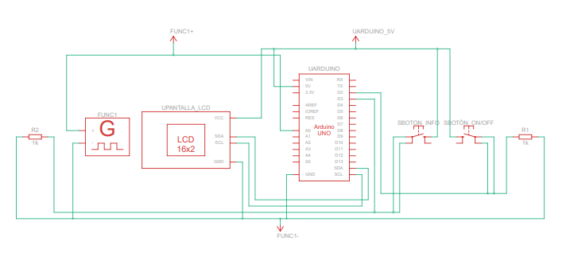

# 🚀 Desafío 1 - Udea 🛠️

¡Bienvenido/a al repositorio del **Desafío 1**! Este proyecto fue realizado por **Oscar Echeverri** y **Esteban Mogrovejo** para el curso de Informatica dos en la Universidad de Antioquia. El objetivo es crear un sistema capaz de capturar y analizar señales analógicas utilizando un Arduino Uno, mostrando los resultados en una pantalla LCD.

## 📋 Descripción del Proyecto

Informa2 necesita un sistema que capture y analice una señal analógica bajo las siguientes condiciones:

- La captura de datos comienza cuando se activa un pulsador.
- Se puede solicitar información de la señal capturada en cualquier momento, lo que pausa la captura hasta que se procesen los datos.
- Los resultados (frecuencia, voltaje y forma de onda) se muestran en una pantalla LCD.

Este sistema simula un entorno controlado en Tinkercad con un generador de señales analógicas y un Arduino Uno.

## 🧑‍💻 Objetivos

1. **Diseño del hardware**: Montaje de un circuito en Tinkercad con un Arduino Uno, pantalla LCD, pulsadores y generador de señales.
2. **Implementación del software**: Desarrollo del algoritmo que permite la lectura de ondas y el análisis de las señales.

## ⚙️ Tecnologías Utilizadas

- **Arduino Uno**: Plataforma de hardware.
- **Tinkercad**: Simulador de circuitos.
- **C++**: Lenguaje de programación para controlar el Arduino.

## 🛠️ Consideraciones para la Solución

1. **Inicialización de componentes**: Preparación de la pantalla LCD y los pines de entrada.
2. **Lectura de entradas**: Control del inicio/pausa de la adquisición de datos mediante pulsadores.
3. **Adquisición de datos**: Conversión de la señal analógica a valores de voltaje.
4. **Cálculo de parámetros**: Determinación de la frecuencia y el voltaje de la señal.
5. **Visualización de resultados**: Presentación de los resultados en la pantalla LCD.
6. **Identificación de forma de onda**: Clasificación de la señal como senoidal, cuadrada o triangular.

## 🔧 Cómo Usar

1. Clona el repositorio:
   ```bash
   git clone https://github.com/Oscar-Echeverry/Desafio_1_Udea.git
   ```
2. Abre el proyecto en Tinkercad para cargar el circuito.
3. Compila y sube el código al Arduino Uno.

## 📊 Esquema del Circuito



## 🏆 Resultados Esperados

- **Amplitud**: 3200.17 
- **Frecuencia**: 6.04 
- **Forma de Onda**: Senoidal

## 🧠 Autores

- **Oscar Echeverri** - [GitHub](https://github.com/Oscar-Echeverry)
- **Esteban Mogrovejo**-[GitHub](https://github.com/Exxdm)